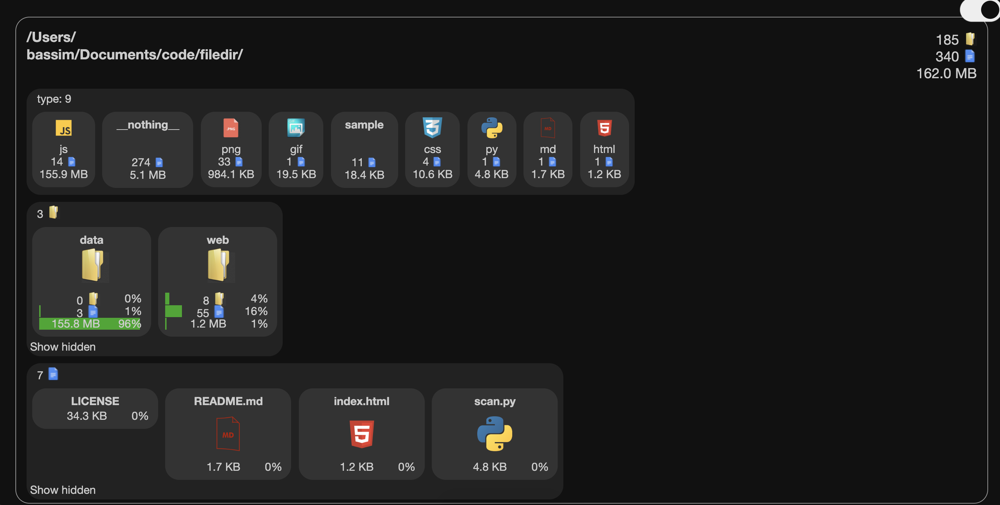

# Filedir
Filedir is a simple tool that can scan files and folders inside a given path.
The data produced by the scan are portable and can be visualized in a browser.



## Scanning
Download the repo and place it on your computer or a server you want to scan.
It needs to be linux or mac and to have python 2 or 3 installed, most computer and server have it by default.
Open a terminal and go to the repo.

Then use the following command:
```
python scan.py path/you/want/to/scan
```
If an error with encoding appear, you can try adding "latin1" as an argument at the end of the command.

After the scan, three files are created inside a data folder, they contain the result of the scan.

## Visualization
If necessary, move or copie the repo on a location where you can see html files.
Inside the repo open the index.html file on a modern browser like Chrome or Firefox (Internet explorer not supported).
Here you can see your files and folders.
- Click on a folder to see what's inside or click on the folder of the path to go back.
- Click on a file type to restrain the view to only this type of file, click again to deselect it.
- Activate the dark mode by clicking on the top right button.

## Description of folder
You can add some a special file inside folders that will be used as a description for the folder.
They have to be named like this
```
_info.txt
```

## Future development
- Add description also for files.
- Support windows scanning (currently only mac an linux)
- Change the way the data are loaded inside the browser to scale better (for now you can reach about half a million files).
- Add test for the scanning and the visualiZation.

## License
This tool is on GPL3 license.
